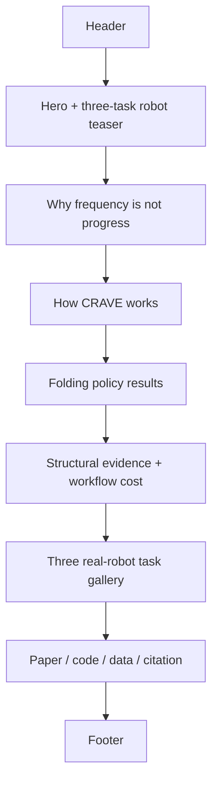

# CRAVE 项目网站设计与实施规划

> 日期：2026-09-26  
> 对应论文：**CRAVE: Recovering Progress from Repeated Demonstrations for Contact-Rich Robot Policy Post-Training**  
> 目标仓库：`YoungYang-GTHB/CRAVE`

## 0. 当前实施快照（2026-09-26）

- [x] 仓库已固定为 `YoungYang-GTHB/CRAVE`，GitHub Pages base path 为 `/CRAVE/`。
- [x] 已生成并落盘 Hero、Method、Results、Gallery 和 Mobile 五组协调概念图。
- [x] 已实现 React + Vite + TypeScript 单页项目站。
- [x] 已接入真实 folding、nail-painting、ordered-writing 帧和自托管短视频。
- [x] folding 主结果、300-episode 结构诊断、跨任务结果和效率阶段数据均由集中数据文件驱动。
- [x] 已建立 design system、content contract、媒体 manifest、release checklist 和自动内容审计。
- [x] GitHub Actions 已改为先执行验证与 Vite 构建，再部署 `dist/`。
- [x] 已完成 1440、1200、768、390 px 浏览器视觉检查，消除桌面标题重叠和平板首屏拥挤。
- [ ] 对外 push / GitHub Pages 发布：等待公开媒体许可和用户明确授权。
- [ ] arXiv 标识可用后更新资源区和 BibTeX。

## 1. 网站目标

CRAVE 网站不是论文 PDF 的网页复刻，也不是通用产品落地页。它承担四个明确任务：

1. **10 秒内建立问题与方法印象**：重复机器人示范本身包含可恢复的跨 episode progress 结构。
2. **立即证明是真机工作**：首屏直接展示叠衣服、美甲和写字，而不是先展示抽象网络图。
3. **让读者复述方法链**：multimodal evidence → recurrent prototypes → episode-level decoding → progress increments → ordinal policy conditions。
4. **提供可信证据与资源入口**：论文、补充材料、真机视频、结果、代码和引用信息均能被快速定位。

一句话网站主张：

> CRAVE recovers task-relative progress from structure repeated across robot demonstrations and turns it directly into conditions for robot policy post-training.

## 2. 选用的设计技能

### 2.1 当前主技能

- **`frontend-app-builder`**：负责完整页面概念、设计 token、实现、响应式检查和浏览器视觉验收。

### 2.2 已安装、下一轮可用

- **`frontend-design`**：来自 `anthropics/skills`，用于形成与机器人科研主题一致、非模板化的视觉方向和版式。
- **`ui-design-intelligence`**：来自 `RobotXTeam/Skills/UI/codex`，包含可检索配色、字体、UX 与图表设计数据，用于校验 palette 和可访问性。

### 2.3 使用顺序

1. `ui-design-intelligence` 给出 palette、字体和可访问性候选；
2. `frontend-design` 冻结 CRAVE 独有的视觉方向；
3. `frontend-app-builder` 生成分区概念图、实现并完成浏览器验收。

新增技能安装后需要在下一轮 Codex 会话中重新加载，不能将本轮尚未加载的技能输出冒充已执行结果。

## 3. 发布与匿名性门禁

当前仓库位于可识别作者的 GitHub 账号 `YoungYang-GTHB` 下，因此它适合**公开项目版**，不适合作为 ICLR 双盲审稿期间直接提交给 reviewer 的匿名链接。

ICLR 2027 官方规则要求论文匿名；若提交演示网站链接，网站必须完全匿名并且不能跟踪访问者。官方说明见：

- [ICLR 2027 Author Guidelines](https://iclr.cc/Conferences/2027/AuthorGuidelines)

网站采用两个发布状态：

| 状态 | 用途 | 必须隐藏 | 允许内容 |
|---|---|---|---|
| Anonymous review build | 如需在审稿期提供给 reviewer | GitHub owner、作者、机构、个人域名、视频水印、可识别 metadata、analytics | 方法、匿名论文、匿名结果、脱敏视频 |
| Public project build | 决策后正式发布 | 无需隐藏作者身份 | 作者、机构、arXiv/OpenReview、代码、数据、citation |

匿名版本的硬约束：

- 不使用 Google Analytics、Plausible、Cloudflare Web Analytics 或任何访客统计；
- 不嵌入 YouTube、Vimeo、Google Fonts 等会产生第三方请求的资源；
- 字体、图片、视频和 SVG 全部自托管；
- 删除媒体 EXIF、编码器 comment、绝对路径、用户账号、机器名和可识别文件名；
- 不从当前带作者用户名的 GitHub Pages 地址向 reviewer 提交链接；
- 如确需匿名演示，生成无 git 历史的独立匿名镜像或审稿 supplementary zip。

## 4. 核心视觉方向

### 4.1 设计概念：Structured Motion Atlas

网站视觉语言来自 CRAVE 的研究对象，而不是通用 AI 网站模板：

- **真实机器人连续帧**是最主要视觉材料；
- 一条细而克制的 progress rail 贯穿页面，将 early、middle、late 三个状态连接起来；
- prototype、trajectory 和 ordinal condition 使用论文中的结构化图形语言；
- 大面积留白和清晰排版承担科研可信度，不使用紫色渐变、霓虹发光或重复卡片墙；
- 页面只在一个位置使用明显动态效果：首屏 demonstration 到 progress path 的一次有意义转变。

### 4.2 配色系统

网站直接继承论文的语义配色，不重新创造另一套品牌色。

| Token | Hex | 用途 |
|---|---:|---|
| `--page` | `#F7F9F8` | 冷调近白页面背景，不使用奶油色模板背景 |
| `--surface` | `#FFFFFF` | 图、视频和局部内容表面 |
| `--ink` | `#14201E` | 主文本与标题 |
| `--muted` | `#5D6B68` | 辅助说明，白底对比度约 5.57:1 |
| `--rule` | `#D9E1DE` | 分隔线与轻边框 |
| `--crave` | `#257C72` | CRAVE 唯一方法强调色，白底对比度约 4.99:1 |
| `--crave-dark` | `#155A52` | 主按钮、hover、深色链接，白底对比度约 8.03:1 |
| `--state` | `#607F91` | visual/state modality 图形，不作为小号正文文字 |
| `--progress-low` | `#B56F61` | early/LOW progress 图形编码 |
| `--progress-mid` | `#B38D55` | middle progress 图形编码 |
| `--progress-high` | `#257C72` | late/HIGH progress 图形编码 |
| `--baseline-light` | `#9AA1A6` | plain policy 基线 |
| `--baseline-dark` | `#555D63` | learned-estimator comparator |

使用规则：

- 珊瑚色和琥珀色在白底上不作为普通字号正文；它们只用于进度区域、线条、marker 和浅色块。
- CRAVE 是方法比较图中唯一饱和路线色；基线保持灰阶。
- 颜色不独自传递信息，同时使用文字、线型、marker 和空间顺序。
- 全站正文、按钮、焦点状态以 WCAG AA 为最低验收目标。

### 4.3 字体建议

- Display / section heading：`STIX Two Text`，与论文数学和学术气质衔接；
- Body / navigation / controls：`IBM Plex Sans`；
- Code / citation：`IBM Plex Mono`；
- 所有字体下载后自托管，匿名版本不调用 Google Fonts。

### 4.4 几何与动效

- 主要容器保持直角或 4--8 px 小圆角；不把所有内容装进大圆角卡片；
- 结果图和视频使用稳定的 16:9、4:3 或论文原始比例；
- 动效只用于解释 progress recovery、视频播放状态和交互反馈；
- 支持 `prefers-reduced-motion`，禁用自动滚动和连续视差；
- 不使用装饰性 pill、发光渐变、虚构统计数字或无含义 dashboard chrome。

## 5. 首页信息架构

初版采用**单页项目网站**，先把论文主线讲完整；后续再按需要拆出 Method、Results 和 Media 子页。



### 5.1 Header

左侧只显示 `CRAVE` wordmark；右侧保留：

- Method
- Results
- Videos
- Paper
- Code（公开后启用）

首屏不加入搜索框、状态 badge、会议 logo 堆叠或多余社交图标。

### 5.2 Hero：先展示真实机器人

建议文案：

> **Recover progress from repeated robot demonstrations.**
>
> CRAVE turns recurrent observation--state structure into ordinal conditions for contact-rich robot policy post-training—without a separately trained value or advantage estimator.

主要动作：

- `Read the paper`
- `Watch robot demos`
- `Explore the method`

Hero 视觉：

- 右侧或下方使用叠衣服为主、美甲与写字为辅的三任务视频/帧带；
- 叠衣服占最大面积，因为它承担论文主实验；
- 视频默认 muted，只有进入可视区域才播放；移动端和 reduced-motion 使用 poster；
- 首屏下缘露出下一节标题，使页面不是封闭海报。

### 5.3 Why：频率不等于进度

用一条真实 episode timeline 解释：

- long holds、repositioning 和 recovery frames 在 BC 中按频率进入训练；
- brief grasp/contact/alignment transitions 对任务完成更关键；
- normalized time 在停顿和局部回退中仍持续增长。

此节不罗列完整 related work，只建立 CRAVE 所解决的具体问题。

### 5.4 Method：从 demonstrations 到 conditions

方法区采用开放式横向流程，而不是八张等宽卡片：

1. Repeated RGB observations + robot state
2. Frozen visual/state representation
3. Joint feature and mixture components
4. Cross-episode coverage filtering
5. Anchored whole-episode decoding
6. Recovered progress path
7. Future progress increments
8. Ordinal conditions and unchanged policy training

桌面端允许用户沿 progress rail hover/focus 查看每一步；移动端变为自上而下的清晰顺序。交互只补充信息，不隐藏方法必需内容。

必须明确：

- progress 不是 value、return 或 calibrated advantage；
- recurrent 指跨 episode 重复支持，不是 RNN；
- CRAVE 离线运行，部署时仅保留 post-trained policy。

### 5.5 Main results：叠衣服

主结果区展示：

- 150 / 300 / 450 demonstrations；
- Plain BC、adapted learned-estimator comparator、Direct CRAVE；
- success 与 absolute mean rollout duration；
- 所有数字从 canonical paper-facing result 文件生成，不在 JSX 中手工复制多份。

展示形式：

- 左侧为可读结论和实验设置；
- 右侧复用统一配色的 Figure 3 数据图；
- 下方提供 `View protocol and full table` 展开区；
- 不把 UR-VC 强行塞入 matched 主表，只在独立 diagnostic 注释中说明。

### 5.6 Why it works：结构证据与工作流成本

这一节使用两段不同节奏的全宽 band：

1. **Whole-trajectory structure**：boundary-error reduction 与 recovery-aligned progress；
2. **Label-construction route**：人工阶段标注、learned estimator training 与 automatic label construction 的阶段对照。

效率图中的 `0` 必须标成 `not required`，不能让读者误解为测量时间四舍五入到零，也不报告未经 matched policy-training 支持的精确端到端加速。

### 5.7 Three-task robot gallery

按研究地位排序，而不是平均分配篇幅：

- **Garment folding**：主实验，多段关键过程与成功/失败案例；
- **Nail painting**：四阶段 task completion，展示精细接触；
- **Ordered writing**：展示 I/C/L/R sequence，定位为低数据迁移案例。

每个视频必须提供：

- poster；
- task、route、checkpoint 和 outcome/coverage 的简短说明；
- controls、caption/文字摘要；
- 不自动播放声音；
- 失败案例若展示，明确其目的，不做猎奇式 failure reel。

### 5.8 Resources

公开版最终提供：

- Paper PDF
- arXiv
- OpenReview
- Code
- Supplementary material
- Dataset / checkpoint（若获准公开）
- BibTeX

资源未开放时显示明确状态，例如 `Code release after review`，不放不可点击的假按钮。

## 6. 桌面线框

```text
┌─────────────────────────────────────────────────────────────┐
│ CRAVE                  Method Results Videos Paper   Code   │
├─────────────────────────────────────────────────────────────┤
│ Recover progress from          ┌─────────────────────────┐  │
│ repeated robot demos.          │ folding sequence        │  │
│                                │ nail + writing insets   │  │
│ [Paper] [Watch demos]          └─────────────────────────┘  │
├─────────────────────────────────────────────────────────────┤
│ Frequency is not progress  ── episode timeline / contacts  │
├─────────────────────────────────────────────────────────────┤
│ demonstrations → features → recurrent structure → progress │
│                  → ordinal conditions → policy             │
├─────────────────────────────────────────────────────────────┤
│ Folding result statement       │ success + duration plot   │
├─────────────────────────────────────────────────────────────┤
│ Whole-trajectory evidence      │ label-route cost          │
├─────────────────────────────────────────────────────────────┤
│ Folding video       Nail video       Writing video          │
├─────────────────────────────────────────────────────────────┤
│ Paper · Code · Supplement · BibTeX                          │
└─────────────────────────────────────────────────────────────┘
```

## 7. 可复用内容与素材清单

以下路径是工作区源文件；实现时应生成 web derivative 并复制到网站仓库，不能在网页中引用绝对路径。

| 网站用途 | 权威源 |
|---|---|
| 首屏三任务图 | `methods/lmvla/paper_iclr_crave/figures/fig1_robot_tasks_v1.png` |
| 方法流程 | `methods/lmvla/paper_iclr_crave/figures/fig2_crave_pipeline_v1.png` |
| Folding success/duration | `methods/lmvla/paper_iclr_crave/figures/fig_task_a1_robot_v1.png` |
| Structural evidence | `methods/lmvla/paper_iclr_crave/figures/fig_cross_task_recovery_v1.png` |
| Efficiency route | `methods/lmvla/paper_iclr_crave/figures/fig_efficiency_route_time_hybrid_evidence_v1.png` |
| Retained prototypes | `methods/lmvla/paper_iclr_crave/figures/fig_crave_milestone_gallery_v1.png` |
| Retained point cloud | `methods/lmvla/paper_iclr_crave/figures/fig_crave_retained_tsne_v1.png` |
| Writing demos | `datasets/kai0/Task_WI/demo/*.mp4`，3 条 720p、约 36--41 s |
| Nail demos | `datasets/kai0/Task_N/demo/*.mp4`，2 条约 144--268 s，需裁剪和压缩 |
| Historical CRAVE visuals | `web/reports/showcase/reports/crave_report/assets/` |
| Positive/normal/negative interpretation | `web/reports/showcase/reports/crave_interp/assets/` |

素材处理原则：

- 网站优先使用真实视频和论文可审计图，不生成虚构机器人照片；
- raster poster 输出 AVIF/WebP，并保留 PNG fallback；
- 视频统一输出 H.264 MP4，必要时增加 WebM；
- raw 美甲视频过长，裁成 8--20 s 的明确阶段片段；
- 首屏单个视频目标不超过约 4--6 MB，其余视频 lazy-load；
- 使用 `ffmpeg -map_metadata -1` 清除 metadata；
- 所有结果图从同一 canonical data 生成，禁止为了网站观感重新计算有利指标。

## 8. 技术方案

### 8.1 推荐栈

- React + Vite + TypeScript
- 原生 CSS variables + CSS Modules 或小规模分层 CSS
- GitHub Actions 构建
- GitHub Pages 发布公开版
- 不引入大型 UI component kit；页面组件围绕论文内容定制

Vite 部署到项目 Pages 时需要配置 repository base path；若后续使用自定义域名，再切换为根路径。

### 8.2 建议目录

```text
.
├── docs/
│   ├── design-system.md
│   ├── content-contract.md
│   └── release-checklist.md
├── public/
│   ├── fonts/
│   ├── media/
│   │   ├── folding/
│   │   ├── nail/
│   │   └── writing/
│   └── paper/
├── src/
│   ├── components/
│   │   ├── Header.tsx
│   │   ├── Hero.tsx
│   │   ├── ProblemTimeline.tsx
│   │   ├── MethodPipeline.tsx
│   │   ├── FoldingResults.tsx
│   │   ├── EvidenceBands.tsx
│   │   ├── RobotGallery.tsx
│   │   └── Resources.tsx
│   ├── data/
│   │   ├── results.ts
│   │   ├── media.ts
│   │   └── links.ts
│   ├── styles/
│   │   ├── tokens.css
│   │   ├── typography.css
│   │   └── global.css
│   ├── App.tsx
│   └── main.tsx
├── scripts/
│   ├── prepare-media.sh
│   └── verify-content.mjs
└── .github/workflows/pages.yml
```

## 9. 响应式与可访问性

### Desktop

- 12-column grid，内容最大宽度约 1120--1200 px；
- Hero 使用文字与真实媒体的不对称构图；
- method pipeline 横向展开；
- 首屏在常见笔记本高度下露出下一节入口。

### Mobile

- 导航收敛为简洁 menu；
- Hero 视频改为 poster 或用户点击后播放；
- method pipeline 纵向排列，保持 1→8 顺序；
- 图表允许水平滚动前先提供文字结论，不依赖缩小到不可读；
- CTA 和视频控件满足触摸目标尺寸。

### Accessibility

- 语义化 landmark 与 heading 顺序；
- 完整键盘导航和可见 focus ring；
- 视频提供文字摘要，关键演示后续补 caption；
- 结果图提供 alt text 及等价数据表；
- 不以颜色作为唯一编码；
- 支持 reduced-motion 和 reduced-data 策略。

## 10. 性能预算

- 首屏不加载全部 demo 视频；
- 首屏 poster 优先，视频在空闲或进入视口后加载；
- 初始 JavaScript gzip 目标小于约 180 KB；
- 首屏媒体传输目标小于约 4 MB；
- 避免 layout shift，所有媒体声明宽高比；
- 桌面与移动端 Lighthouse accessibility / best-practices 目标不低于 95；
- Core Web Vitals 目标：LCP < 2.5 s、CLS < 0.1。

## 11. 实施阶段

### Phase 0 — 内容和发布边界冻结

- [x] 当前仓库明确为 author-identifiable public build，不作为匿名 ICLR 链接；
- [x] 冻结网站使用的标题、主张边界、canonical 结果数值和资源链接；
- [ ] 由素材所有者完成三个公开视频片段的最终发布授权；
- [ ] 在正式公开作者区前确认作者、机构和 acknowledgements 的公开版本。

### Phase 1 — 素材审计与 web derivatives

- [x] 选择 folding、nail、writing 的代表片段；
- [x] 生成自托管短视频与真实机器人 poster；
- [x] 排除网页中的内部任务名、绝对路径、外部字体和第三方媒体请求；
- [x] 为每个媒体建立 provenance manifest。

### Phase 2 — 概念设计

按 `frontend-app-builder` 要求，分别生成并审阅以下概念，而不是只生成一张模糊长图：

- [x] Hero + first viewport；
- [x] Problem + method section；
- [x] Results + evidence section；
- [x] Robot gallery + resources section；
- [x] Mobile hero 和 mobile method flow。

概念获批后冻结设计 token、copy、section order 和媒体裁切方式，再进入编码。

### Phase 3 — 实现

- [x] 初始化 React/Vite/TypeScript；
- [x] 建立 tokens、自托管字体和全局网格；
- [x] 按 section 概念逐段实现；
- [x] 接入真实结果数据和媒体；
- [x] 将构建明确约束为 public release；匿名版本如有需要再单独建立；
- [x] 配置 GitHub Pages workflow。

### Phase 4 — 验收

- [x] 在 1440、1200、768、390 px 视口逐区与概念图对比；
- [x] 检查标题、copy、palette、字体、图片裁切和 section rhythm；
- [x] 测试 keyboard、reduced-motion、菜单、视频播放与资源链接；
- [x] 通过自动检查核对网站数字、术语与论文 canonical results；
- [x] 确认无 analytics、第三方字体或第三方媒体请求；
- [x] 运行生产 build、TypeScript 与内容契约检查；
- [ ] 正式公开前补跑 Lighthouse，并将报告作为 release record 保存。

### Phase 5 — 发布

- [ ] Anonymous review build：仅在确有需要且完成匿名审计后发布；
- [x] Public build：已加入当前作者 citation、论文 PDF、OpenReview 与 code release 入口；
- [x] 设置 social preview、favicon、SEO description 和 `robots.txt`；
- [x] 通过 GitHub Actions 发布并核验公开首页、PDF 与三个视频资源；
- [ ] arXiv identifier 可用后替换 preprint 占位信息；
- [x] 媒体 manifest 已记录视频字节数与 SHA-256；工作流编号写入 release checklist。

## 12. 首版验收标准

网站首版只有同时满足以下条件才算完成：

1. 首屏能够在 10 秒内回答“CRAVE 做什么”和“是否为真实机器人实验”；
2. 新读者能按顺序复述 CRAVE 的 progress-relabeling 流程；
3. folding 主结果、结构证据和效率边界与论文完全一致；
4. 三个任务均有真实媒体，writing 不再只存在于文字描述中；
5. 配色与论文一致，CRAVE 为唯一方法强调色；
6. 无模板化 purple gradient、卡片墙、虚构数字或无意义动效；
7. 桌面和移动端均无溢出、重叠、不可读图表或不可操作视频；
8. 匿名版无身份信息、tracking 或第三方资源请求；
9. 浏览器实现与获批概念图经过 `view_image` 并排检查并达到设计验收标准。

## 13. 下一步

下一轮建议依次执行：

1. 团队确认三个视频片段可以公开，以及作者/机构的公开版本；
2. 补齐最终 arXiv 标识（当前 PDF 与 citation 使用 preprint 占位语义）；
3. 运行 Lighthouse 并保存 release 截图与 hash；
4. 经明确授权后 commit/push，由 GitHub Actions 发布到项目 Pages 地址。
